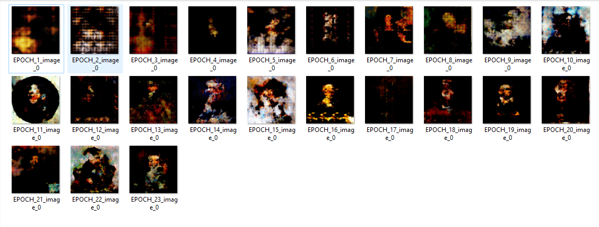

# GENERATIVE-ADVERSARIAL-NETWORK
Following are the result from GAN ,two different versions has been implementation so far

Models has been trained on [DATASET](https://www.kaggle.com/datasets/karnikakapoor/art-portraits)

1.Deep Convolutional Generative Adversarial Network : DC-GANs

2.Wasserstein Generative Adversarial Networks : WGANs
