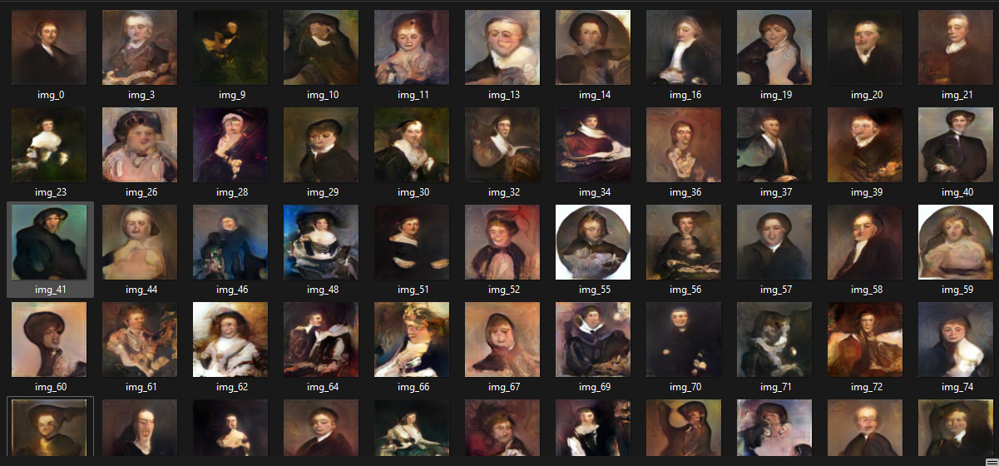

# Generative Adversarial Networks (GANs)

This repository contains implementations of Generative Adversarial Networks (GANs) with three different architectures. The models are trained on a dataset to explore the potential of GANs in generating realistic data. Each version implements a unique approach to enhance training stability and output quality.

Models has been trained on [DATASET](https://www.kaggle.com/datasets/karnikakapoor/art-portraits)

## Implemented Models

1. **Deep Convolutional Generative Adversarial Network (DC-GAN):**
   - Uses convolutional layers to improve image generation.
   - Stable architecture for generating high-quality outputs.

2. **Wasserstein Generative Adversarial Network (WGAN):**
   - Introduces Wasserstein loss to improve training stability.
   - Reduces mode collapse issues often encountered in standard GANs.

3. **Progressive Growing GAN (Progressive GAN):**
   - Gradually increases model complexity during training.
   - Generates images with higher resolution by progressively training on smaller resolutions first.

## Overview
GANs are a class of deep learning models that use two neural networks, a generator and a discriminator, competing against each other in a zero-sum game. The generator creates synthetic data, while the discriminator distinguishes between real and synthetic data, enabling the generator to improve over time.

### Features
- Three GAN architectures implemented from scratch.
- Training pipeline for high-quality data generation.
- Focus on stable and efficient GAN training methods.

## Getting Started

### Prerequisites
- Python 3.8+
- Virtual environment (optional, recommended)

### Generating Images
To generate images using pretrained models:

- **DC-GAN:**
  

- **WGAN:**

- **Progressive GAN:**

  

## Future Work
- Extend support to additional GAN architectures, such as StyleGAN.
- Implement advanced loss functions for better results.
- Explore applications in video generation and 3D modeling.

## Contributions
Contributions are welcome! Feel free to open issues or submit pull requests for improvements or new features.

## License
This project is licensed under the MIT License. See the LICENSE file for details.

## Acknowledgments
- Inspired by research papers and open-source implementations of GANs.
- Special thanks to the deep learning community for resources and support.

